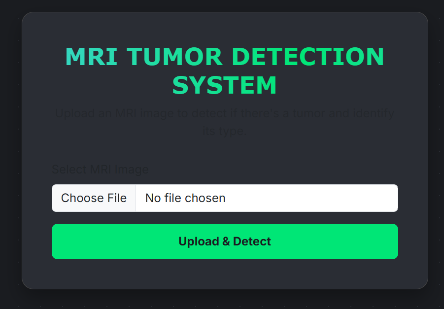

# Brain Tumor Classification Web App

This project is a real-time brain tumor classification application built with FastAPI. It provides a simple web interface where users can upload an MRI scan of a brain, and the application will return a prediction of whether the scan shows a tumor and, if so, its type.

The application leverages a pre-trained deep learning model from **KaggleHub**, which is automatically downloaded and loaded on startup.

---

## 🖼️ Project Showcase



---

## ✨ Key Features

- **Interactive Web Interface:** A clean and simple UI built with Jinja2 templates.
- **Real-Time Predictions:** Upload an MRI image and get an instant classification.
- **Four Classification Classes:** The model can classify scans into four categories: `glioma`, `meningioma`, `pituitary` tumor, and `no tumor`.
- **Confidence Score:** Displays the model's confidence in its prediction.
- **Automatic Model Downloading:** Utilizes the `kagglehub` library to fetch and load the required Keras model automatically, so you don't need to manually download it.
- **High-Performance Backend:** Built with the asynchronous FastAPI framework for fast and efficient request handling.

---

## 🛠️ Tech Stack

| Component                     | Technology                                                                                                                                                                                                       |
| ----------------------------- | ---------------------------------------------------------------------------------------------------------------------------------------------------------------------------------------------------------------- |
| **Backend Framework**   |                                                                                                            |
| **ML / Deep Learning**  |   |
| **Model Hub**           |                                                                                                               |
| **Server**              |                                                                                                             |
| **Frontend Templating** |                                                                                                                  |
| **Core Libraries**      |               |

---

## 📁 Project Structure

```
.
├── main.py                     # The main FastAPI application file
├── templates/
│   └── index.html              # The HTML template for the user interface
├── uploads/                    # Directory where uploaded images are saved (created automatically)
├── requirements.txt            # List of Python dependencies
└── README.md                   # You are here!
```

---

## 🚀 Getting Started

Follow these steps to set up and run the project on your local machine.

### Prerequisites

- Python (3.8 or newer)
- Git
- A Kaggle account and your Kaggle API token (`kaggle.json`). The `kagglehub` library requires you to be authenticated. Follow the [Kaggle API documentation](https://www.kaggle.com/docs/api) to set up your credentials (usually involves placing your `kaggle.json` file in `~/.kaggle/`).

### Installation & Setup

1. **Clone the repository:**

   ```bash
   git clone https://github.com/amineelgardoum-rgb/tumor.git
   cd tumor
   ```
2. **Create a virtual environment (recommended):**

   ```bash
   # For macOS/Linux
   python3 -m venv venv
   source venv/bin/activate

   # For Windows
   python -m venv venv
   .\venv\Scripts\activate
   ```
3. **Create the `requirements.txt` file:**
   Create a file named `requirements.txt` and add the following dependencies to it:

   ```txt
   fastapi
   uvicorn[standard]
   python-multipart
   jinja2
   tensorflow
   numpy
   Pillow
   kagglehub
   ```
4. **Install the dependencies:**

   ```bash
   pip install -r requirements.txt
   ```
5. **Create the HTML Template:**
   Create a `templates` directory and inside it, create an `index.html` file. You'll need to create your own HTML form for the file upload. A basic example is provided in the FastAPI documentation, which you can adapt.

### Running the Application

Once you have completed the setup, run the application with Uvicorn:

```bash
uvicorn main:app --reload
```

The server will start, and the application will be available at **[http://127.0.0.1:8000](http://127.0.0.1:8000)**.

---

## How to Use:

1. Open your web browser and navigate to `http://127.0.0.1:8000`.
2. Click on the "Choose File" button and select an MRI brain scan image.
3. Click the "Upload" or "Predict" button.
4. The page will refresh, displaying the prediction result (e.g., "Tumor: glioma"), the model's confidence score, and the image you uploaded.
